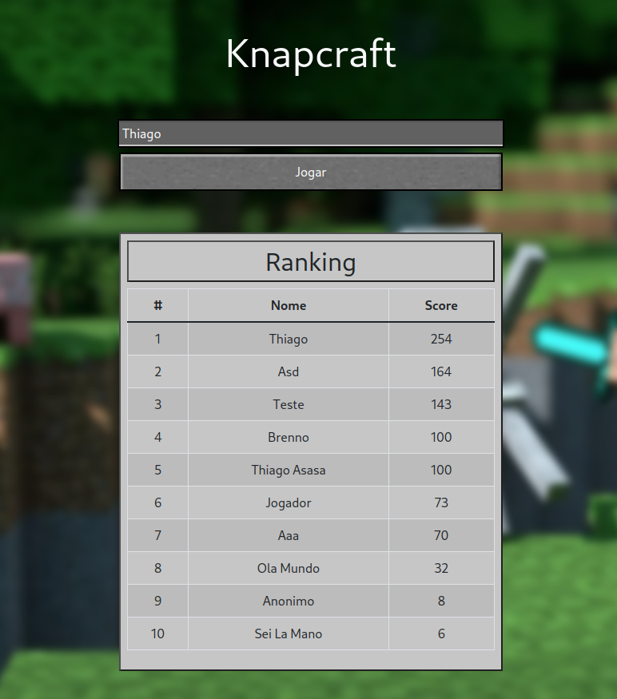

# Knapcraft

**Número da Lista**: 20 
**Conteúdo da Disciplina**: PD 

## Alunos

| Matrícula  | Aluno                   |
| ---------- | ----------------------- |
| 19/0025379 | Brenno Oliveira Silva   |
| 19/0020377 | Thiago Sampaio de Paiva |

## Sobre

O Knapcraft consiste na utilização do algoritmo de knapsack em programação dinâmica para gerar o melhor valor dado um conjunto de .

## Apresentação

[Video da Apresentação](assets/apresentacao/apresentacao.mp4)

## Screenshots

## Instalação

**Linguagem**: Typescript 
**Framework**: NextJS 

## Uso

Para utilizar o projeto acesse: https://pd-knapcraft.vercel.app/ ou rode os comandos:
npm install 
npm run dev
